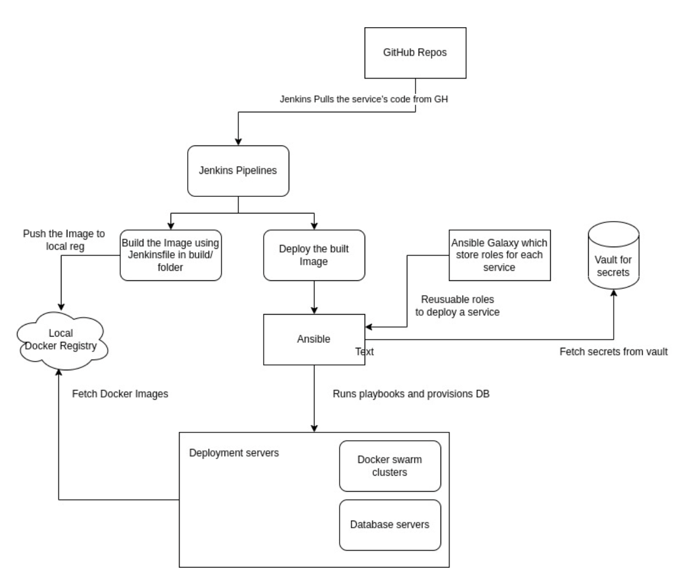

# How we are setting up the things
--- 

 
 * Visual Demo of different services that are up through portainer.io
 * Multibranch pipelines instead of freestyle project
 * DB pipelines to provide any DB
 * Configuration of Vault for secrets
 * Single source of truth, everything is on a git repo and fetched from there only
 * Explanation of next steps to integrate ansible-galaxy and host ansible collections

### Components
 * **GitHub Repos**: Microservices are developed on this platform, code is pushed merged etc. We can also leverage GitHub Actions for CI - (testing and building of the image).

* **Jenkins Pipeline**: Jenkins is a job runner which executes a series of tasks depending on the config.
        **Development Pipelines**: Pipelines to manager for development  environment.
        **Production Pipelines**: Pipelines to manager for development  environment.

* **Private Docker registry**: To hold build artefacts
Hashicorp Vault: Used to store secrets and credentials in one place to be used by different microservices. Developers can specify creds here and ansible can pick up those creds from here. It also provides RBAC.

* **Docker Swarm**: Docker swarm to deploy services on a docker swarm cluster
Ansible Galaxy (Future Scope): Add ansible roles to an ansible-galaxy of the building blocks in Samagra. One can easily pull the ansible roles accordingly depending upon their use case. 


In every repo/project we have a folder name **build** inside which there is a **Jenkinsfile** file which contains the automation code.

sample jenkins file in nodejs


```tsx 
 pipeline {
    agent { docker { image 'node:16.17.1-alpine' } }
    stages {
        stage('build') {
            steps {
                sh 'node --version'
            }
        }
    }
}
```
So once a developer pushed a code to the repo (main or any particular branch)