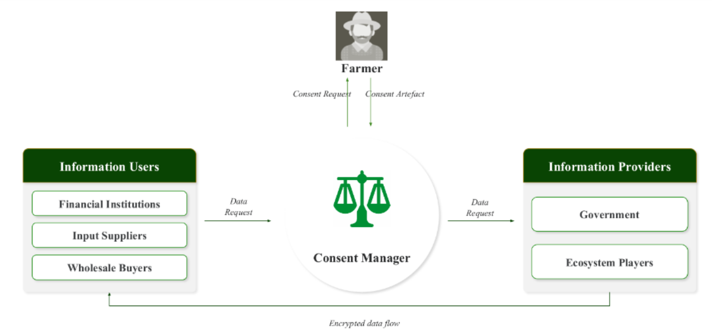
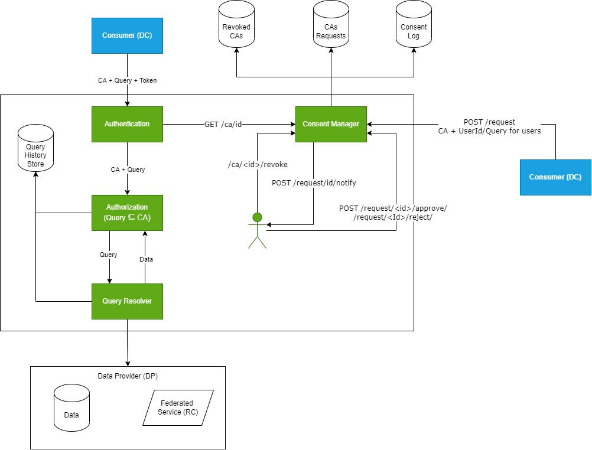
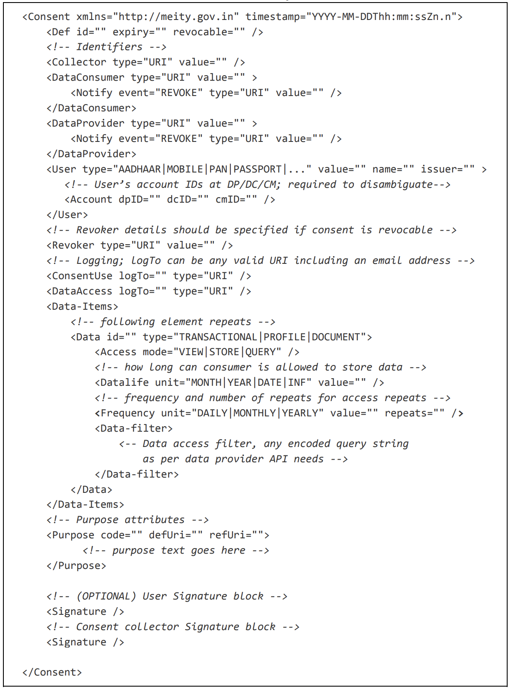

# Agriculture Data Exchange

Agriculture data exchange (Agridex) is a Data Empowerment And Protection Architecture (DEPA) compliant data fiduciary block that empowers farmers to seamlessly and securely access their data and share it with third-party institutions in a consent-driven way. A major block within the Agri Data Exchange is the consent manager block which creates and manages the lifecycle of a consent request from the data owner.

Agridex offers farmers a choice of relevant information and services along with tools to control their own data, empowering them to increase their income. When combined, the data generated by farmer and organization interactions can enable a wide variety of applications to support farmers to be built on top of Agridex. For instance, by combining farmer profile information with other datasets (e.g., soil, weather, market prices), we can customize videos to be more responsive to farmer needs, to be disseminated via online and offline channels. Farmers can access these customized services and adopt relevant, targeted practices. Similarly, Agridex can improve access to inputs, markets, and credit.

---
## Use Cases

1. Consent manager block enables data request transactions and provides authorization based on data owner’s consent 
2. Data consumers in the ecosystem can request for data owners consent to consume data that exists in Krushak Odisha DB for providing services
3. Stores and updates farmer consent for usage of data attributes by requesting party
---
## Architecture

Agriculture data exchange is a Data Empowerment And Protection Architecture (DEPA) compliant data fiduciary block that enables farmer consent driven access to data for third-party data requesters.

### Guiding design principles

1. **User Centricity:** Users should be at the center of any data sharing and should be given adequate control and decision-making power on how data associated with them is shared 
2. **Trustable and IT Act Compliant:** Use digital signatures to guarantee integrity of access permissions given by users in consent flows. This avoids security issues faced by existing approaches and also makes the framework fully legal under the IT Act 
3. **Universal Identity:** The technical framework should leverage universal, authenticable, non-repudiable, and digital identities to allow interoperability across service providers 
4. **Granular Control:** The framework should allow users to set permissions and rights for data access at a granular level 
5. **Open Standards Based:** The framework should use open technology and legal standards available in the country. It should be agnostic to applications, programming languages, and platform

**Agri Data Exchange performs the following :**
- Consent manager block enables data request transactions and provides authorization based on data owner’s consent
- Data consumers in the ecosystem can request for data owners consent to consume data that exists in (state agricultural database) for providing services
- Stores and updates farmer consent for usage of data attributes by requesting party

---
### Block functions
1. **Authentication** - Verifies the authenticity of a data consumer
2. **Consent artifact** - A consent artifact is a machine-readable electronic document that specifies the parameters and scope of data that a user consents to in any data-sharing transaction. In this framework, consent must be digitally signed, either by the user or by the consent collector or both
3. **Authorization (GateKeeper)** - Verifies if the Query requested has the required permisions from the data owner (farmer) (checks if query is a subset of Consent Artifact)
4. **Query Resolver** - Verifies Queries and gets data from external sources/ or state databases
5. **Consent Manager** - Creates and Manages the lifecycle of a Consent Artifact. From request, ,generation, and revoke/expiry
6. **UI for Consent Manager**
7. **UI for User**

---
### Consent lifecycle
1. **Consent Approval** - Results in creation of a Consent Artifact
2. **Consent Revocation** - Results in a revoked Consent Artifact
3. **Data Consumption** - Consumer successfully gets data back when sharing a valid consent artifact
4. **Logging and Notification** - All events in the consent flow and data flow must be logged and notified as necessary using Consent Log artifact. A log artifact contains the consent artifact along with information about when and by whom the log was created

### Sample Consent Artifact 

