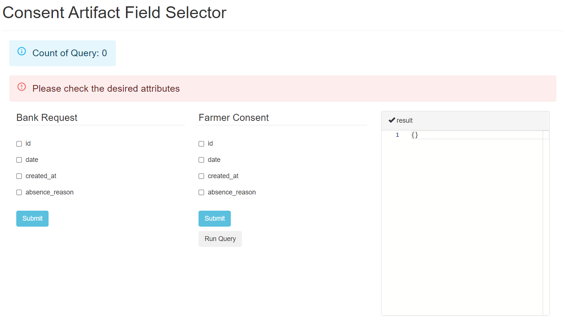
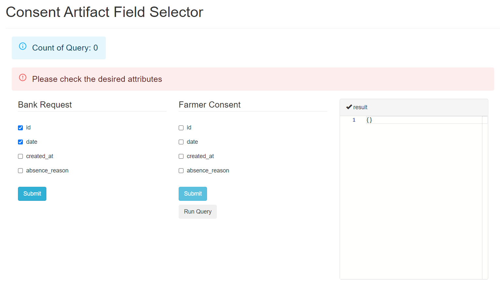
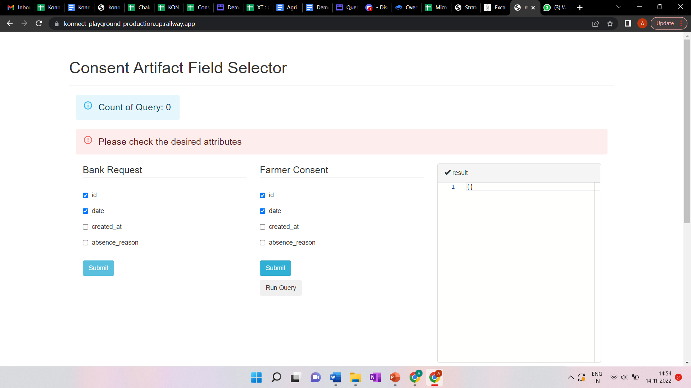
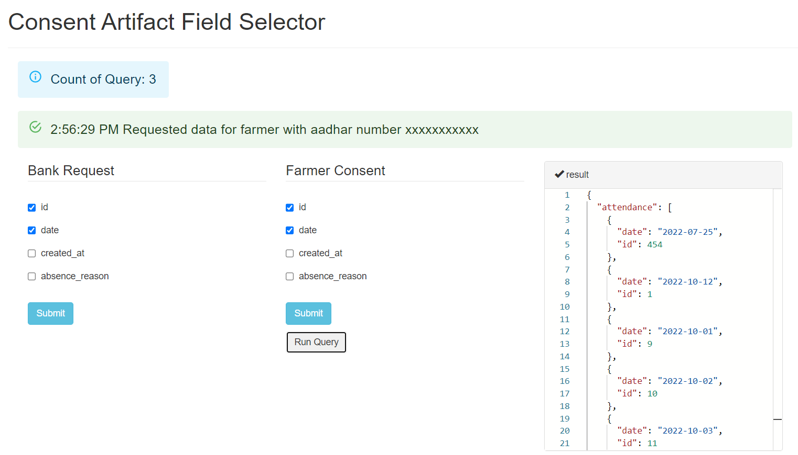

# AgriDex - Query resolver (manually created consent artifact)

### Objective

To test the query resolver block, the block receives data query (request) from the data consumer and upon checking the consent artifact for permissions given by the farmer forwards requested data to the data consumer. (Query resolver architecture)

### Demo Setup

1. **Count of query** - Checks the number of  times data is requested, the consent artifact defines a limit to number of times a data consumer can request farmer data based on the farmer’s accorded permissions (currently hard-coded to 2 times)
2. **Bank request** - This collection of fields that a data consumer wants access to for a particular farmer
3. **Farmer consent** - This mimics a consent artifact, where farmer defines the fields for which he wants to give permission to the data consumer to use his data  (in subsequent demos this will be provided by consent manager in the form of a consent artifact)
4. **Result** - Output console which reflects requested data in the form of JSON

### Steps of the Demo (demo playground)

- **Bank request:** Select fields you want to select to request as a data consumer and click submit button bellow bank request section

- **Farmer consent:** Select fields that you want to mimic as accorded permission given by a farmer and click on submit button below farmer consent

- **Result:** After clicking on Run Query button, the result gets reflected in the result console

