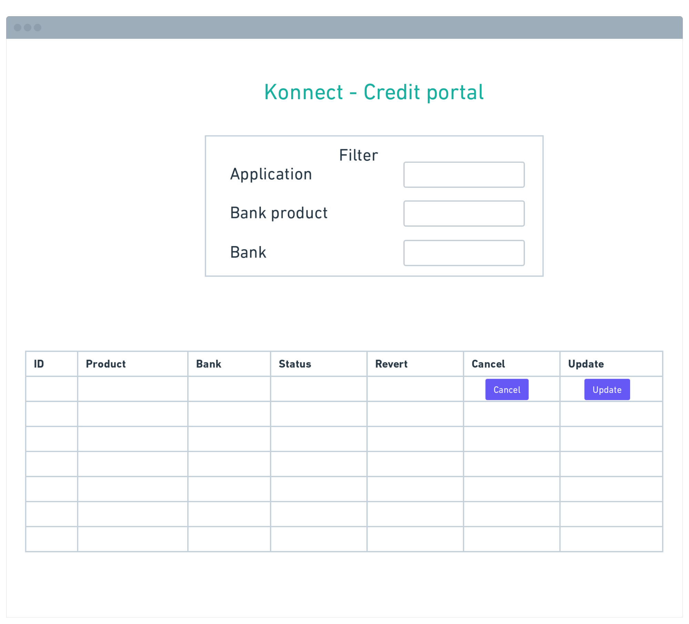
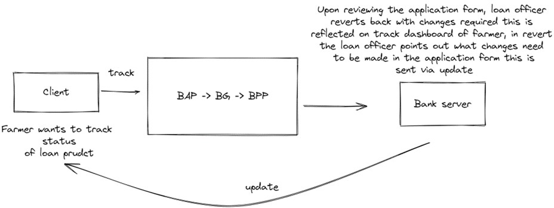

# UFSI: Update, Track, Cancel, Rate, Support

### Objective - Creation of sample credit portal

- Enable farmers to track application, in case of any requirement for updating application forms, 
- The farmer can also cancel any product request, rate loan product, and also seek support from provider bank on any loan product

### Enabled use cases

1. Farmer - Logsin into the credit portal and moves to clicks on the track tab to launch the dashboard all the credit application

2. Bank - Upon receiving application form post init flow, loan officer sends revert and changes that need to be made in the application in the update spec
3. Farmer - Based on the revert comments, the farmer fills the application form again and submits

4. Farmer - Incase the farmer wants to cancel the application/ loan product he clicks on the cancel button on the track dashboard and the loan officer is notified of the cancellation
5. Farmer - After status updated changes to approved and disbursed, farmer can rate the loan services on the loan product by the specific bank 

