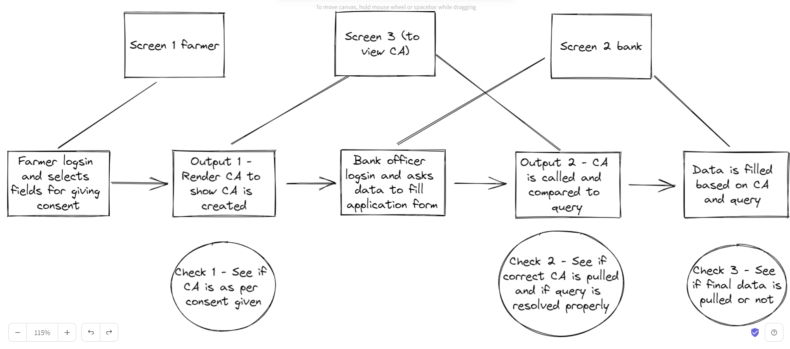
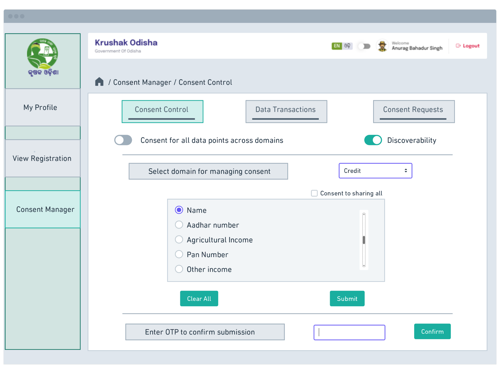
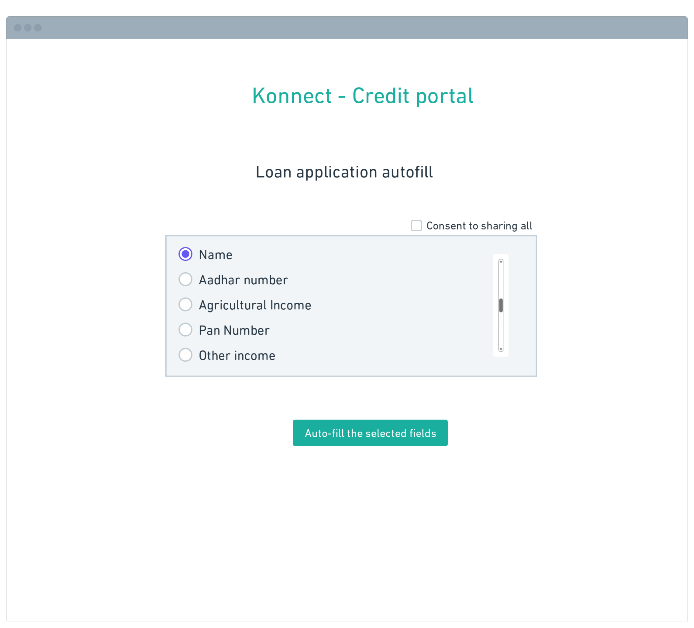

#  AgriDex  + Query resolver (consent artifact provided by consent manager dynamically)

### Objective

To test the entire consent cycle including
- Farmer defined access to data fields
- Creation of consent artifact based on farmer permission
- Bank requesting access to farmer data (to auto-fill loan application form)
- Resolution of query when compared to the Consent artifact
- Final rendering of the data requested by bank on the application form

### Demo setup

1. Screens involved
    1. Farmer screen - To enable farmer to chose consent for all data field for credit use case

    2. Bank screen - To enable bank to request data that will be filled up
    3. CA screen - Screen to help anyone testing or demoing to view 
        1. CA creation
        2. CA call
        3. CA and query resolution 

2. Blocks of the demo
    1. Consent Manager
    2. Query resolver
    3. Database (a sample from KO to be used)
    4. 3 UI screens

### Steps and test cases

1. Farmer - Selects fields for giving consent (Screen 1)
    1. Data
    2. Field names with checkbox
        1. Name
        2. Aadhar
        3. Phone number
        4. Marital status
    3. Button to allow consent for selected fields
    4. Button to revoke consent (for all fields)

2. CA - Render CA on screen 2 to view 
    1. Test 1 - Is the CA correct (how can we check this? @CG)
3. Bank manager - Requests farmer data to fill form, screen to include
    1. Application form with the following
        1. Name
        2. Aadhar
        3. Phone number
        4. Marital status
    2. Request button to request for these 4 entries
4. Bank Manager - The application form gets filled or not based on the consent artifact

