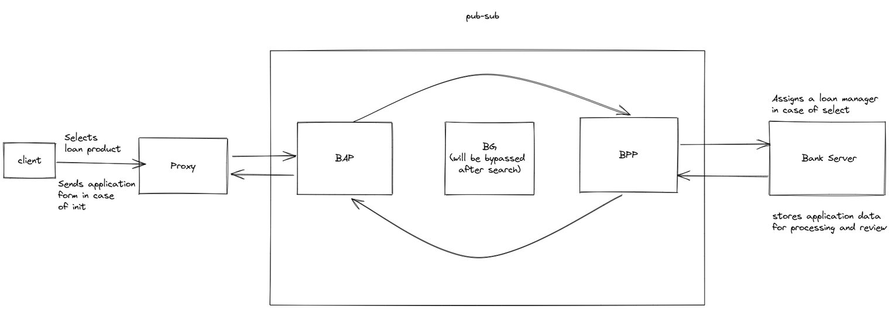
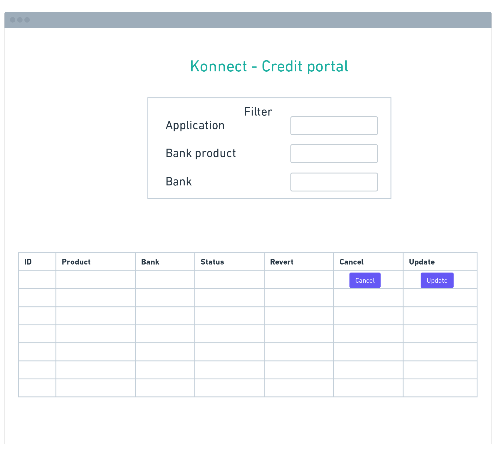

# Konnect stack with integrated UFSI and AgriDex

### Elements of the Demo

1. UIs
    1. Farmer credit portal
    2. Bank credit portal
    3. Login to accept consent

2. UFSI
    1. The UIs will use all flows and specs of UFSI (search, select, init, confirm, track, cancel, update)
    2. In the init spec where the farmer has to fill loan application the fields will get auto-populated based on farmer consent (AgriDex)

3. AgriDex
    1. Demonstrating that the loan application of a farmer gets auto populated based on the KO database up based on the farmers consent

4. UFSI BeckN app flow (below is a sample flow for select spec)

    

    1. Client - Farmer side application (farmer credit portal) - Here farmer selects any product
    2. Proxy - Establish to help route requests from client to the beck-in-a-box block block
    3. BeckN Application Platform - Connects client side to the netowork
    4. BeckN Provider Platform - Connects provider side to the network
    5. Bank server - Enables bank to revert to all client request (across discovery, order, fulfillment, post-fulfillment)

### Objective

1. To demo all UFSI specs for discovery, order, fulfillment, and post-fulfillment for farm loan product
    1. Implication
        1. Spec
        2. BeckN Applications (BAP, BG, BPP)
        3. Flow
        4. User interface

2. Showcase working consent lifecycle 
    1. By auto-filling application form in the init flow

---

### Flow

1. Farmer - Logins into the credit portal 

2. Farmer - Searches for credit products with the following filters 
    1. District
    2. Block
    3. Bank

    (Search ⇒ A simple search request that returns a catalog as per Beckn core spec for the /on-search route)

    
 
3. Farmer - Selects one of the products shown on the table as per search criterion 

    (select ⇒ this action/route basically maps to creation of an order, hence an order will be created with the selected loan item)

4. Farmer - A draft credit order popups up, farmer is nudged to fill application form

    (init ⇒ this route actually deals with entering payment and shipping details, which will map to filling out the LoanApplicationForm in our use case)

    [ Decisions on how init will render different application forms for different  products/ banks,
    - Init spec will include customisable application form query 
        - will add a provider-specific (farmer) field “specific_applicant_details” which will be queried from a federated server and displayed to the user (bank) 
        - this will allow the bank to send the delta of their forms which does not conform with the “loan application doc” spec as JSON
        - Combination of the two will be the entire application form of the loan product ]

5. Farmer - Upon application submission, the order is routed to bank manager (loan officer) and the order is confirmed

    (confirm ⇒ in our use case this will be mapped to the bank manager (of loan officer) confirming our request has been successfully submitted for verification

    The aadhar of user also gets mapped here to the order ID (to be used in track))

    
6. Farmer - Logsin into the credit portal and moves to clicks on the track tab to launch the dashboard all the credit application

    (track ⇒ track spec enables farmer to revert to any application re-submissions that are required by the loan officer)

    

7. Bank - Upon receiving application form post init flow, loan officer sends revert and changes that need to be made in the application in the 

    ( update => update spec enables bank server to trigger a request for updating application form that gets reflected on farmers track flow)

8. Farmer - Based on the revert comments, the farmer fills the application form again and submits

    
9. Farmer - Incase the farmer wants to cancel the application/ loan product he clicks on the cancel button on the track dashboard and the loan officer is notified of the cancellation
