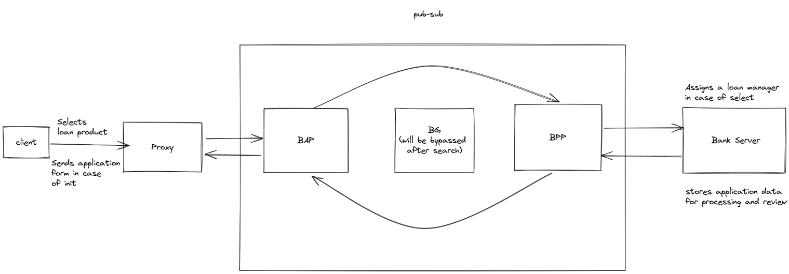

# Goal of the Demo

The vision of the POC is to enable all functions for a credit use case including,

- Search -  Search by farmer of desired credit product
- Select - Farmer selects the credit product 
- Init - The order gets initiated and farmer can fill loan application
- Confirm - Farmer can see his submitted loan product
- Track - Farmer can track all application form filled by him
- Update - Upon review of application, loan officer reverts back the loan to the farmer
- Cancel - Application form gets canceled by farmer

**Elements of the POC**

1. Farmer side portal
2. Bank side portal 
3. UFSI (transaction spec - discovery, order, fulfillment, post-fulfillment)

**UFSI flow for one sample spec (Search)**

1. **Client**- Farmer side application (farmer credit portal) - Here farmer selects any product
2. **Proxy** - Establish to help route requests from client to the beck-in-a-box block 
3. **BeckN Application Platform** - Connects client side to the netowork
4. **BeckN Provider Platform** - Connects provider side to the network
5. **Bank server** - Enables bank to revert to all client request (across discovery, order, fulfillment, post-fulfillment)

