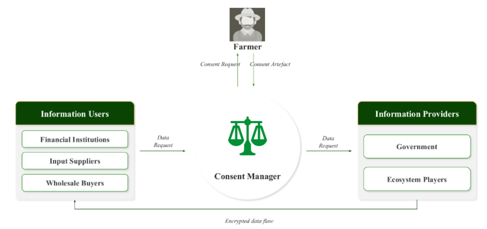
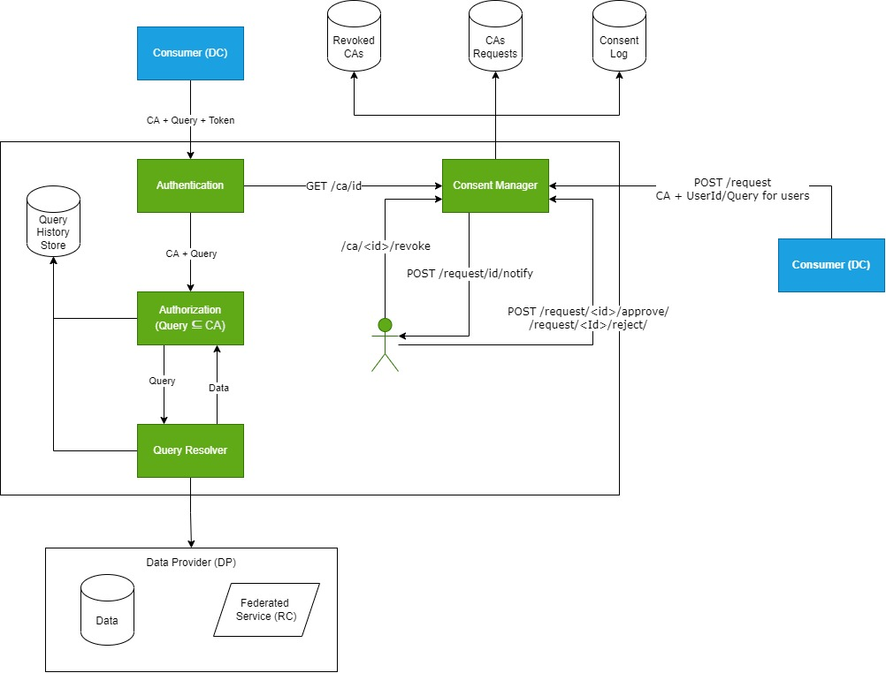

## Architecture

AgriDex is a Data Empowerment And Protection Architecture [(DEPA)](https://www.niti.gov.in/sites/default/files/2020-09/DEPA-Book.pdf) compliant data fiduciary block that enables farmer consent driven access to data for third-party data requesters. 

The consent manager for Konnect program is based off of the Electronic Consent Framework put forth by Ministry of Electronics and Information Technology (MeitY). Documented [here](https://dla.gov.in/sites/default/files/pdf/MeitY-Consent-Tech-Framework%20v1.1.pdf). MeitY describes the framework as `open, secure, user-centric, and application-agnostic`. 

### Guiding design principles
1. **User Centricity:** Users should be at the center of any data sharing and should be given adequate control and decision-making power on how data associated with them is shared 
2. **Trustable and IT Act Compliant:** Use digital signatures to guarantee integrity of access permissions given by users in consent flows. This avoids security issues faced by existing approaches and also makes the framework fully legal under the IT Act 
3. **Universal Identity:** The technical framework should leverage universal, authenticable, non-repudiable, and digital identities to allow interoperability across service providers 
4. **Granular Control:** The framework should allow users to set permissions and rights for data access at a granular level 
5. **Open Standards Based:** The framework should use open technology and legal standards available in the country. It should be agnostic to applications, programming languages, and platform

### Working 

Code: [Konnect-Agri/consent-manager](https://github.com/Konnect-Agri/consent-manager)

#### Block functions
1. **Authentication** - Verifies the authenticity of a data consumer
2. **Consent artifact** - A consent artifact is a machine-readable electronic document that specifies the parameters and scope of data that a user consents to in any data-sharing transaction. In this framework, consent must be digitally signed, either by the user or by the consent collector or both
3. **Authorization (GateKeeper)** - Verifies if the Query requested has the required permisions from the data owner (farmer) (checks if query is a subset of Consent Artifact)
4. **Query Resolver** - Verifies Queries and gets data from external sources/ or state databases
5. **Consent Manager** - Creates and Manages the lifecycle of a Consent Artifact. From request, generation, and revoke/expiry
6. **UI for Consent Manager**
7. **UI for User**

### Consent lifecycle
1. **Consent Approval** - Results in creation of a Consent Artifact
2. **Consent Revocation** - Results in a revoked Consent Artifact
3. **Data Consumption** - Consumer successfully gets data back when sharing a valid consent artifact
4. **Logging and Notification** - All events in the consent flow and data flow must be logged and notified as necessary using Consent Log artifact. A log artifact contains the consent artifact along with information about when and by whom the log was created

### Sample Consent Artifact 

