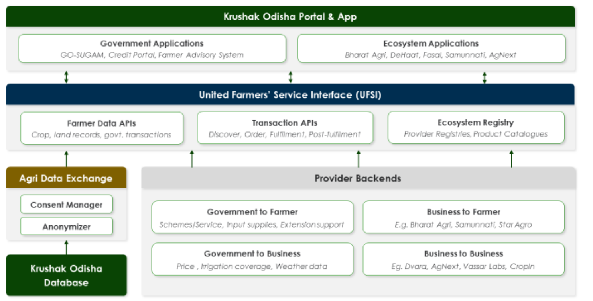

---
# Konnect Stack

The aim of the Agriculture Stack is to establish an open ecosystem platform that facilitates fair market conditions for farmers, thereby enabling the agricultural value chain to function at an optimal level. This is achieved by reducing information asymmetry through sharing of data in a consented way and providing farmers with more choices through an open digital ecosystem. Agri stack comprises two main blocks, the Unified Farmers Service Interface (UFSI) and the Agriculture Data Exchange (AgriDex). 

---
## Use Cases 

1. Create a platform to link farmers, policy makers, buyers and farm service providers.
2. Enable services for farmers across farm inputs, credits, markets, and extension services.
3. Farmer data across KO and other federated data can be consumed in a consented and secure manner.
---
## Architecture

Konnect embarks on a journey of creating a decentralized network of farm service providers, agricultural data providers, policymakers, and farmers through an interoperable protocol specification to enable the markets to work for the farmers while ensuring farmer data privacy and consent.

