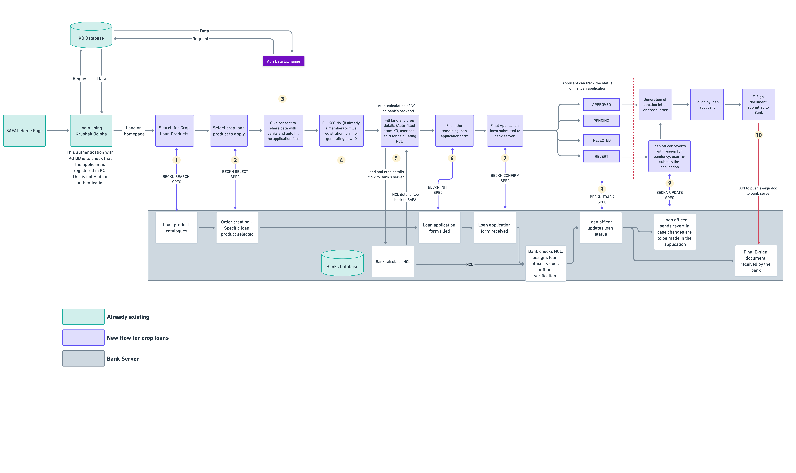

# Crop Loans

Credit is vital in improving agriculture production. Availability and access to adequate, timely and low-cost credit from institutional sources are very important, especially to small and marginal farmers. However, it has been commonly seen that the farmers are often forced to avail credit from informal sources (local money lenders, dealers etc.) for multiple reasons - 
* Awareness about loan products through formal financial institutions
* Cumbersome application process (difficult paperwork, multiple visits to the branch)
* Lack of formal financial history for the banks to take the decisions

To solve some of the above problems, the Government of Odisha has conceptualized and launched [SAFAL](https://safal.odisha.gov.in/website/home) (Simplified Application for Agricultural Loans) portal. It is a one-stop solution for farmers and agri-entrepreneurs to avail of credit from formal financial institutions. The portal will facilitate the farmers and the banks by providing various loan products to the farmers. 

### Flow

### [Technical Implementation](./tech/index.md)

Aashutosh to add
