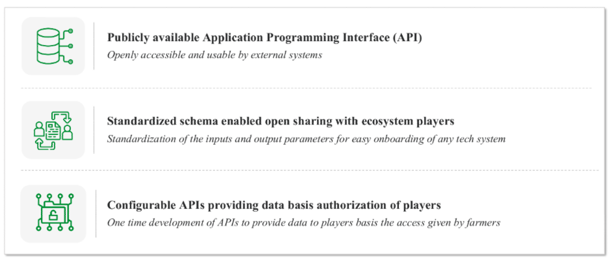
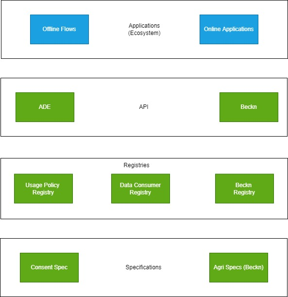
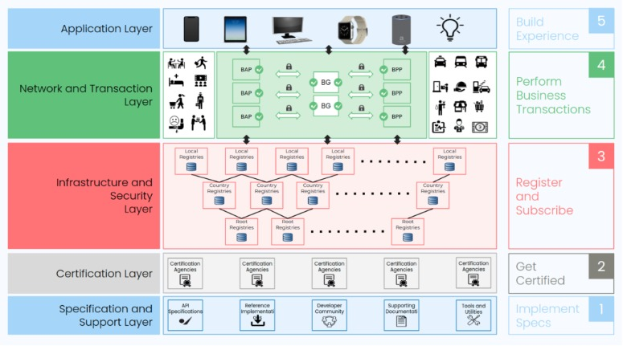

# Unified Farmers’ Service Interface (Decentralized network)

UFSI is envisaged to play a role comparable to UPI (Unified Payment Interface) in the space of digital payments. While UPI has transformed payment systems by optimizing the underlying processes and providing a set of APIs for identification, authentication, and authorization, UFSI is required to handle multiple types of transactions in the digital agriculture space through a set of open specifications and standard APIs. This set of open specifications is known as Beckn protocol. 

[Beckn](https://becknprotocol.io/) is an open protocol that allows local businesses across any industry to be discovered and engaged by any beckn-enabled application. Beckn protocol helps businesses co-create solutions for the masses seamlessly, by combining services of any form or provider. Beckn defines contracts or protocols for communication between entities sharing information. 

---
## Use Cases

1. Creation of open and configurable APIs for farmer data usage
2. Transactional APIs for service discovery, order, fulfillment, and post-fulfillment
3. Based on the data and transactional APIs, registries will be created for providers and cataloged products
---
## Architecture

UFSI is a decentralized network with interoperable protocol specification which includes,
- Open and configurable APIs to help leverage farmer data
- Transactional APIs for service discovery, order, fulfillment, and post-fulfillment
- Registries created for providers and cataloged products or services

### Three parts of UFSI

#### Architecture

1. **Agri Data Exchange (ADE)** - providing a safe and secure way for consent driven access of farmer data
2. **BeckN** - a set of specifications consisting of APIs, data models, reference architecture, transaction mechanisms, and global standards that enable the creation of decentralized network
3. **Usage Policy Registry** - a registry created by the data governors to exercise usage control. A usage policy is a PDF artifact generated by the governing authority for access to data. This allows for storage of policy in a registry for legal requirements
4. **Data Consumer Registry** - a registry which ensures every data consumer is registered and provided with a unique token, which is in turn used to identify a consumer
5. **BecN Registry** - Certification on a Beckn-enabled network works by listing the network participants on the registrars of the certification authority. Any network participant listed on an open registry is implicitly assumed to be certified

