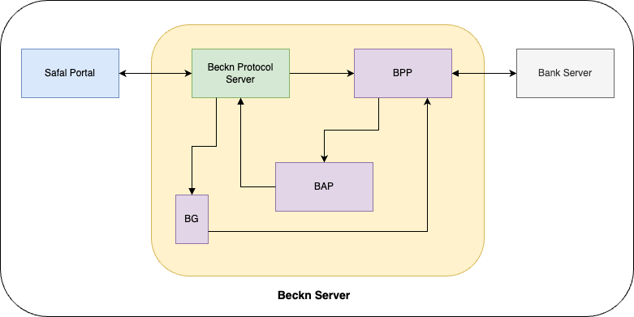

# Crop Loans - Tech

### Using Beckn
Beckn is an open protocol that allows local businesses across any industry to be discovered and engaged by any beckn-enabled application. Beckn protocol helps businesses co-create solutions for the masses seamlessly, by combining services of any form or provider.
Beckn defines contracts or protocols for communication between entities sharing information. In our context the information is loan information and the 2 entities are the Safal portal and Banks. Multiple banks can follow the same protocol/contract to share loan information with our users.

More information about Beckn can be found below,
* Beckn Protocol - https://becknprotocol.io/
* Beckn Developer Central - https://developers.becknprotocol.io/
* Beckn Overview- https://developers.becknprotocol.io/docs/introduction/video-overview/

### Entities

There are 3 participating entities in the crop loans:
* Safal Portal
* Beckn Server
* Banks

### API docs

To view the latest Swagger documentation:
* Visit https://editor.swagger.io/
* Paste this [YAML file](https://raw.githubusercontent.com/Konnect-Agri/AgriDex-Beckn/master/docs/swagger.yaml) into the editor
