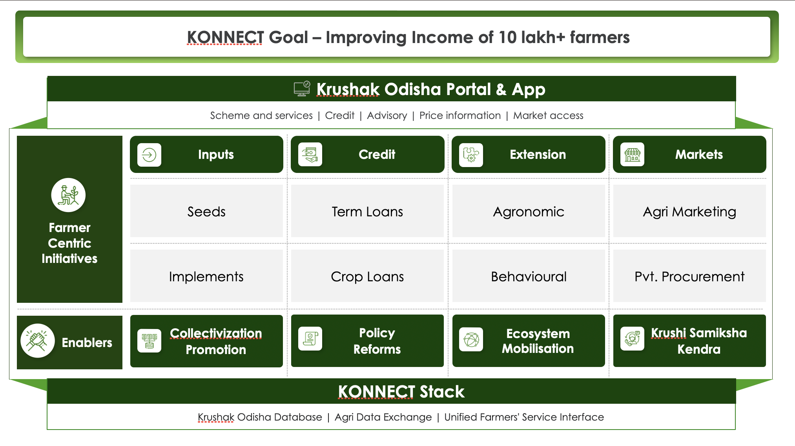

Samagra, with support from the Bill & Melinda Gates Foundation, is working with the Government of Odisha to improve the income of farmers in the state. It intends to do this by making the markets work for the farmers and by enabling the agri-value chain to operate at a higher equilibrium. To this end, the program aims to reduce information asymmetry and increase the choices available to farmers.

### Goal

To improve farmer's income

### Approach

Samagra’s approach to improving the income of farmers is to push for four core administrative and technical reforms. These include developing a tech platform to enable core interactions within the agricultural ecosystem, introducing farmer-centric initiatives across major steps of the value chain, putting in place enablers to drive adoption of the tech platform among farmers, ecosystem players and system actors, and lastly, sharply defining goals with regular income measurement.

- Improving access to ecosystem players across the agricultural value-chain
- Reducing information asymmetry for the farmers
- Setting up a technology stack to enable phygital access to farmer-centric services

### Structure

* Krushak Odisha Portal & App
* Farmer Centric Initiatives
    * Inputs
    * Credit
    * Extension
    * Markets
* Enablers
* Promotion
* Policy reforms
* Ecosystem mobilisation
* Krushak Samiksha Kendra
* [Konnect Stack](../initiatives/konnect_stack/index.md)

